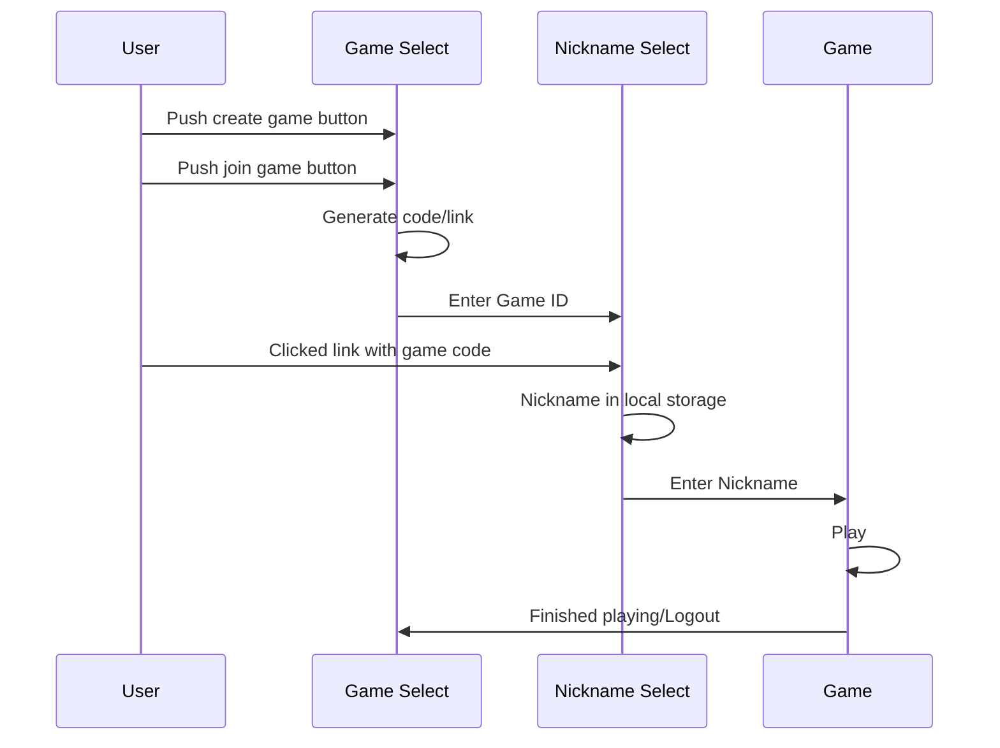

# zombieApp

Elevator pitch: An app to help organize games of zombie tag through the tracking and communication of who is currently infected and when someone has been tagged.

Key Features
    - Create game and generate authentication code and link
    - Join game through authetication code or shared link
    - Real time updates of who has become a zombie through push notifications
    - Set timelimts on games

Technologies
    I am going to use the required technologies in the following ways

    - HTML: Four different views from app homescreen to game selection to nickname selection and finally game play.
    - CSS: Zombie themed colorscheme and images
    - React: Single page application with routing between views, reactive user controls, and state hooks.
    - Service: Endpoints for authentication, storing and retrieving of games, and use of push notifications
    - DB/Login: Stores current game state and push notification configuration
    - WebSocket: Realtime updates of player infection status

HTML deliverables
    
- [x] HTML Pages: I made my index page along with the pages necessary for playing through a game (creat_game. enter_joincode, waitingroom, and game_running are the page names)
- [x] Links Between Pages: The index page contains links to wither the creat_game page or the enter_joincode page and both those pages are linked to the waitroom page which is linked to the game_running page where the game actually takes place.
- [x] 3rd party: images over players names are representations of implemenation of gravatar 3rd part for avatar generation. Implemenation of gravatar is represented through the Use Gravatar button on the enter_joincode and create_game pages
- [x] Text: Each page has text explainig what to do and what inputs are being asked for, buttons are all labled as well
- [x] Images: avatar images used in waitroom and game_running above players nicknames
- [x] Login Placeholder: Generation of game code when creating a game on creat_game page and the entering of game code as an input in the enter_gamecode page represent logging into specific games with nicknames chosen every game. Nicknames are user names being displayed in the waitingroom and game_running pages.
- [x] Database Placeholder: The number of players in the waitroom page and number of infected and survivors in the game_running page represent data pulled from a database
- [x] Websocket Placeholder: The broadcasting of a message if your infected using the Announce Infection button on the game_running page represents the realtime announcment of infections

CSS deliverables:

- [x] Reviewed, cloned, examined, and deplyed Simon css
- [x] Created css deliverables for each of my pages and had my name displyed in the footer of the title page along with a link to the github repo.
- [x] Made several commits to Github for every session I worked on the project
- [x] Added some notes to my notes.md file
- [x] Pushed finalized version to my github repo.
- [x] Successfully deployed my application to my product environment
- [x] Application is avilable at infect.cwnel.com
- [x] Uploded url to canvas and turned in assignemnt

ReactP1 deliverables:

- [x] Followed instructions for and successfully ported simoncss to react, then deployed to my production environment simon.infect.fyi
- [x] Converted my HTML/CSS to use react. Installed Vite, React, and Bootstrap and reorganized my files to the formatting Vite expects. Created a react router to route between each page using button inputs.
- [x] My name and a link to the github repo are displayed in the footer of each page
- [x] Made several commits and pushes to github while working on the porject
- [x] updated notes.md to help remember things i learned
- [x] Pushed final version onto Github
- [x] Deloyed to production environment infect.cwnel.com
- [x] infect.cwnel.com is publically available
- [x] Uploaded and submitted url to Canvas

ReactP2 deliverables:

- [x] Cloned and deployed Simon React to simon.infect.fyi
- [x] Implemented Javascript code to make my pages functional and reactive
- [x] My name and github link are displayed in the footer
- [x] Updated notes.md as needed
- [x] Pushed to Github several times over several days
- [x] Deployed to my production environmnet at infect.cwnel.com
- [x] infect.cwnel.com is publicly available
- [x] Uploaded startup URL to canvas assignment

StartupService deliverables:

- [x] Cloned and deployed Simon Service
- [x] Created service/index.js with the specified code added
- [x] Added vite.config.js file with specified code
- [x] Created endpoints for backend
- [x] Called thrid party cat fact api endpoint for home page
- [x] Debugged my application using VS Code Node debugger
- [x] Periodically pushed and commited to github
- [x] Coppied deployService.sh from Simon
- [x] Deployed to my domain
- [x] Uploaded URL to canvas

StartupDB Deliverables:

- [x] Cloned and deployed Simon Service
- [x] Added code for connecting to database
- [x] Application data, games and players, stored in Mongodb
- [x] Debugged application in VS Code and browser
- [x] Commited to Github regularly
- [x] Pushed final version to github
- [x] Deployed to production environment
- [x] Uploaded URL to canvas