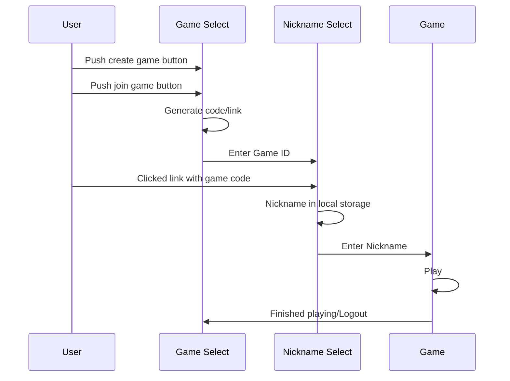

# zombieApp

Elevator pitch: An app to help organize games of zombie tag through the tracking and communication of who is currently infected and when someone has been tagged.

Key Features
    - Create game and generate authentication code and link
    - Join game through authetication code or shared link
    - Real time updates of who has become a zombie through push notifications
    - Set timelimts on games

Technologies
    I am going to use the required technologies in the following ways

    - HTML: Four different views from app homescreen to game selection to nickname selection and finally game play.
    - CSS: Zombie themed colorscheme and images
    - React: Single page application with routing between views, reactive user controls, and state hooks.
    - Service: Endpoints for authentication, storing and retrieving of games, and use of push notifications
    - DB/Login: Stores current game state and push notification configuration
    - WebSocket: Realtime updates of player infection status

HTML deliverables
    
- [x] HTML Pages: I made my index page along with the pages necessary for playing through a game (creat_game. enter_joincode, waitingroom, and game_running are the page names)
- [x] Links Between Pages: The index page contains links to wither the creat_game page or the enter_joincode page and both those pages are linked to the waitroom page which is linked to the game_running page where the game actually takes place.
- [x] 3rd party: images over players names are representations of implemenation of gravatar 3rd part for avatar generation. Implemenation of gravatar is represented through the Use Gravatar button on the enter_joincode and create_game pages
- [x] Text: Each page has text explainig what to do and what inputs are being asked for, buttons are all labled as well
- [x] Images: avatar images used in waitroom and game_running above players nicknames
- [x] Login Placeholder: Generation of game code when creating a game on creat_game page and the entering of game code as an input in the enter_gamecode page represent logging into specific games with nicknames chosen every game.
- [x] Database Placeholder: The number of players in the waitroom page and number of infected and survivors in the game_running page represent data pulled from a database
- [x] Websocket Placeholder: The broadcasting of a message if your infected using the Announce Infection button on the game_running page represents the realtime announcment of infections

