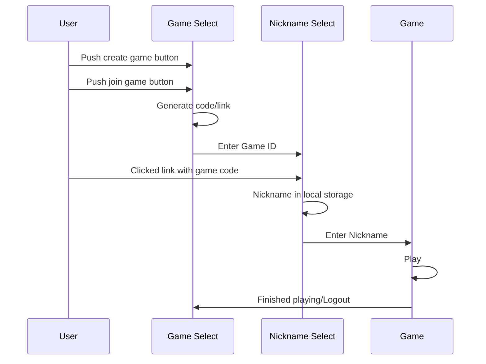
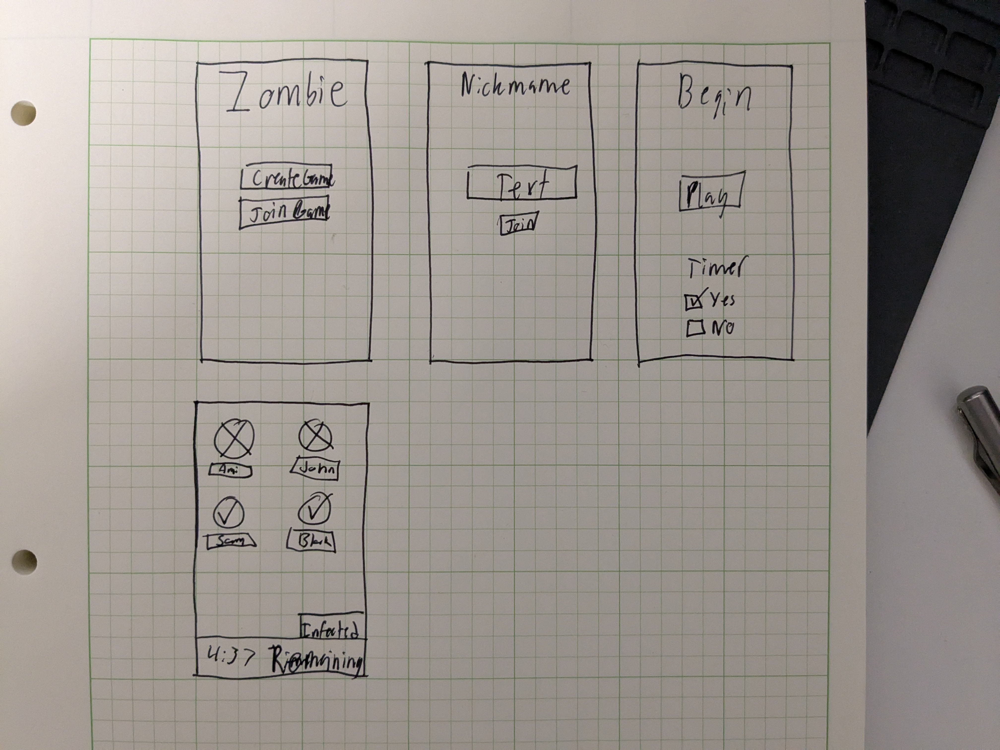

# zombieApp

Elevator pitch: An app to help organize games of zombie tag through the tracking and communication of who is currently infected and when someone has been tagged.

Key Features
    - Create game and generate authentication code and link
    - Join game through authetication code or shared link
    - Real time updates of who has become a zombie through push notifications
    - Set timelimts on games

Technologies
    I am going to use the required technologies in the following ways

    - HTML: Four different views from app homescreen to game selection to nickname selection and finally game play.
    - CSS: Zombie themed colorscheme and images
    - React: Single page application with routing between views, reactive user controls, and state hooks.
    - Service: Endpoints for authentication, storing and retrieving of games, and use of push notifications
    - DB/Login: Stores current game state and push notification configuration
    - WebSocket: Realtime updates of player infection status
